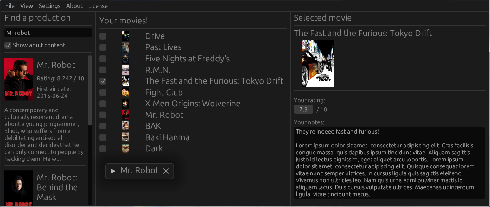

# Movie Desk
### Your personal storage for movie reviews

## Supports:
- fetching productions
- opening production in the browser
- fetching information about seasons and episodes
- setting ratings and creating notes
- saving user data to memory along with all user changes
- reading user data
## TMDB integration:

An `API key` is required to fetch information about productions however, once a production is serialized
the data related to it will not need to be refetched when the program is restarted.  
How to obtain the key: https://developer.themoviedb.org/docs

#### Disclaimer
App is still in development and is highly unstable
